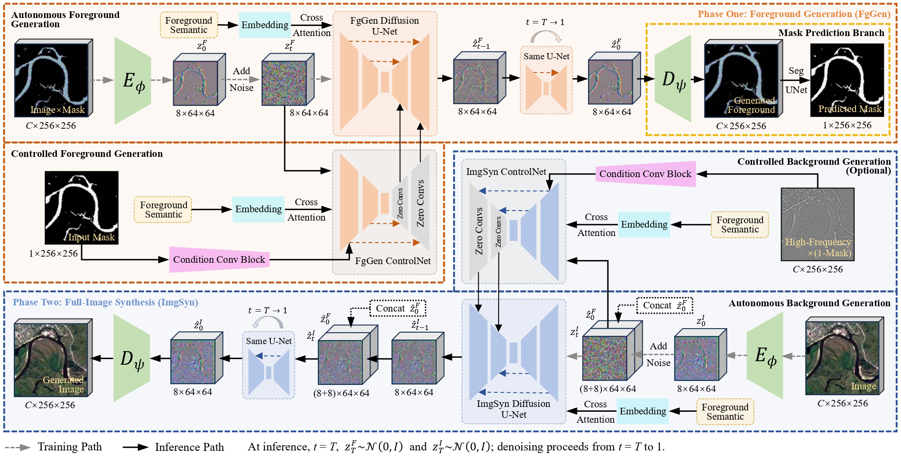
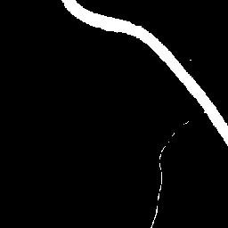
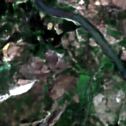
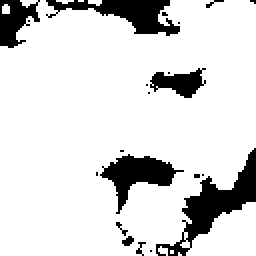
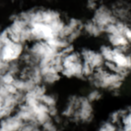
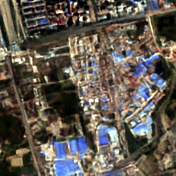

# IMPGM

**A two-stage latent diffusion framework for multiband remote sensing image-mask pair generation**

IMPGM generates spatially corresponding remote sensing images and binary masks
for dataset augmentation. It separates foreground generation (FgGen) from
full-image synthesis (ImgSyn), using foreground latents as cross-stage
conditions to carry spatial structure and foreground features into full-image
denoising. The framework supports both mask-conditioned and autonomous
generation, with optional background-reference control.

## Highlights

- **Foreground-driven two-stage generation:** Foreground latents explicitly condition full-image synthesis, providing a mechanism for maintaining mask-boundary correspondence and foreground-background coordination.
- **Compact, stage-wise training:** Compact network configurations, latent-space modeling, and module sharing are used to limit training resource requirements.
- **Optional inference extensions:** DDIM sampling, background-reference control, multi-condition composition, and overlap-aware large-image generation extend the core workflow.

## Framework



The main mask-conditioned processing chain is:

```text
Class label + binary mask + noise
    -> FgGen Diffusion with FgGen ControlNet -> foreground latent
Foreground latent + noise
    -> ImgSyn Diffusion -> full-image latent -> shared VAE decoder
    -> generated image + input mask
```

Here, foreground denotes the annotated target region, including land-cover
targets or clouds. Full-image synthesis generates the complete scene rather
than simply pasting the foreground onto an independently generated background.

## Generation Modes

| Manuscript label | Foreground generation | Background generation | Mask source |
|---|---|---|---|
| IMPGM (default) | Mask-conditioned, using FgGen ControlNet | Autonomous, using ImgSyn Diffusion | Input mask |
| IMPGM (autonomous) | Autonomous, using FgGen Diffusion | Autonomous, using ImgSyn Diffusion | FgSeg U-Net applied to the decoded foreground |
| IMPGM (controlled) | Mask-conditioned, using FgGen ControlNet | Reference-conditioned, using ImgSyn ControlNet | Input mask |

Autonomous generation still uses class labels; it does not mean completely
unconditional generation. Background control additionally requires reference
information, currently the high-frequency component of the reference
background. It is not part of the mask-only default benchmark.

## Visual Examples

The following three examples use the default mask-conditioned IMPGM workflow.
White mask regions indicate the target area. Displayed images use a 1st-99th
percentile linear stretch, consistent with the manuscript's qualitative figure.
These are selected visual examples, not a complete benchmark.

| Example | Condition mask | Generated image |
|---|---|---|
| Main / Water |  |  |
| Main / ManyCloud |  |  |
| FBP / Urban residential land |  |  |

## Repository Structure

```text
Img-Msk_Pair_Generation_Model_V1.0/
|-- assets/                         # Framework figure and selected visual examples
|-- VAE/                            # Shared VAE and latent calibration
|-- FgGen/                          # Foreground Diffusion and ControlNet
|-- ImgSyn/                         # Full-image synthesis and pipeline entry points
|-- FgSeg_UNet/                     # Mask extraction for autonomous generation
|-- Multi_Condition_Generation/     # Inference-time condition composition
|-- Large_Image_Generation/         # Window scheduling, resampling, and blending
|-- Quality_Evaluation/             # Feature extractors and evaluation U-Net
|-- Evaluation/                     # Shared evaluation code and local outputs
|-- configs/
|   |-- datasets/                   # Paths, classes, bands, and normalization
|   |-- runtime/                    # Shared training and hardware settings
|   `-- tasks/                      # Model, loss, scheduler, and preload settings
|-- Diffusion_Block.py              # Shared network blocks
|-- Diffusion_Sampler.py            # DDPM and DDIM sampling
|-- IMPGM_Config.py                 # Configuration assembly and artifact paths
|-- IMPGM_Dataset.py                # Image-mask loading and preprocessing
|-- IMPGM_Pixel_Losses.py            # Frequency and edge auxiliary losses
|-- IMPGM_Utils.py                  # Model loading, saving, and common utilities
`-- requirements.txt               # Pinned Python dependency reference
```

## Environment

Python 3.11 is recommended. The main dependencies are PyTorch, torchvision,
NumPy, Albumentations, GDAL (`osgeo`), rasterio, PyYAML, TensorBoard, PIQA,
and LPIPS. Comparison models also use libraries such as diffusers and
transformers.

Select a PyTorch build appropriate for your accelerator and driver, and then
install the project dependencies:

```bash
python -m pip install -r requirements.txt
```

GDAL is intentionally excluded from `requirements.txt`. Download the GDAL
3.8.4 wheel from the
[v2024.2.18 release of cgohlke/geospatial-wheels](https://github.com/cgohlke/geospatial-wheels/releases/tag/v2024.2.18)
and select the file matching the Python version and Windows architecture. For
the recommended Python 3.11 environment on 64-bit Windows, download
`GDAL-3.8.4-cp311-cp311-win_amd64.whl`. Install the downloaded wheel from its
local path, for example:

```powershell
python -m pip install "C:\path\to\GDAL-3.8.4-cp311-cp311-win_amd64.whl"
```

Here, `cp311` denotes CPython 3.11 and `win_amd64` denotes 64-bit Windows. Use a
different wheel when the interpreter version or system architecture differs.
Verify the local installation with:

```bash
python -c "from osgeo import gdal; print(gdal.VersionInfo('--version'))"
```

The current requirements pin `torch==2.11.0` and `torchvision==0.26.0`. If a
different PyTorch build is needed, review these pins before installation; pip
may otherwise replace an existing installation. The file is a dependency
reference, not a portable environment lockfile. Full reproduction in a newly
created environment has not yet been verified.

GPU training is strongly recommended. Training uses BF16 autocast and
microbatching; check device support and reduce the appropriate microbatch size
in `configs/runtime/default_train.yaml` if GPU memory is insufficient.

## Dataset Preparation and Configuration

The supplied experiment configurations are:

| Dataset | Configuration | Bands | Target classes |
|---|---|---:|---|
| Main | [main.yaml](configs/datasets/main.yaml) | 4 | Water and four cloud-coverage classes |
| FBP | [fbp.yaml](configs/datasets/fbp.yaml) | 4 | Urban residential land |
| LoveDA | [loveda.yaml](configs/datasets/loveda.yaml) | 3 | Agriculture |
| SFQ2019 | [sfq2019.yaml](configs/datasets/sfq2019.yaml) | 4 | Paddy |

Each configuration also defines background/reference classes such as `NoObj`,
`NoCloud`, or `NoPaddy`. Main uses `FewCloud`, `LessCloud`, `MoreCloud`, and
`ManyCloud` for cloud-coverage conditions.

Update the existing machine-specific dataset paths before running the code.
The loader expects the following conventions:

1. Configure image and mask directories for `train`, `valid`, `test`, and `draw` in `dataset.splits`. `draw` is for training snapshots, not validation.
2. The second-to-last underscore-separated filename token must be a class label defined in `dataset.prompt_map` in the selected `configs/datasets/<dataset>.yaml` file.
3. Images and masks must be spatially aligned. Masks must be single-channel binary data (`0` and `1`), with unique filenames across the mask directories of a split.
4. Match the image band count, raw-value scale, normalization statistics, and visualization band order to the selected dataset.

For example, the Water and NoObj training samples for Main can be organized
under `D:/IMPGM_Data/Main/` as follows:

```text
D:/IMPGM_Data/Main/
`-- train/
    |-- Water/
    |   |-- scene_data_Water_0001.tif
    |   `-- scene_data_Water_0002.tif
    |-- WaterMask/
    |   |-- scene_mask_Water_0001.tif
    |   `-- scene_mask_Water_0002.tif
    `-- NoObj/
        `-- scene_data_NoObj_0001.tif
```

The corresponding entries in [configs/datasets/main.yaml](configs/datasets/main.yaml)
are shown below. `dataset.prompt_map` refers to the `prompt_map` field under
`dataset`, alongside `splits`; it is not a file path. Its keys are the class
labels in filenames, and its values are the class IDs used by the model:

```yaml
dataset:
  splits:
    train:
      image_roots:
        - "D:/IMPGM_Data/Main/train/Water"
        - "D:/IMPGM_Data/Main/train/NoObj"
      mask_roots:
        - "D:/IMPGM_Data/Main/train/WaterMask"
  prompt_map:
    NoObj: 0
    Water: 1
    NoCloud: 2
    FewCloud: 3
    LessCloud: 4
    MoreCloud: 5
    ManyCloud: 6
```

`Water/scene_data_Water_0001.tif` is paired with
`WaterMask/scene_mask_Water_0001.tif` by filename; identical image and mask
filenames are also supported. Classes starting with `No`, such as NoObj,
receive zero masks without mask files. List their image directories last in
`image_roots`.

Point the YAML entries to the file-containing directories, not their parent
`train/` directory. The loader only reads `.tif` or `.tiff` files directly in
these directories; it does not search subdirectories.
This example only shows two classes in the training split; configure the other
classes and the `valid`, `test`, and `draw` splits in the same way.

The model input image shape is `C x 256 x 256`, where `C` is the number of
image bands; the corresponding latent shape is `8 x 64 x 64`.
Train/validation/test splits must remain independent. Do not substitute test
data for a missing validation split.

### Selecting a Dataset

Run all commands below from the project root. Select the dataset explicitly
before starting Python.

PowerShell:

```powershell
$env:IMPGM_DATASET_YAML = (Resolve-Path "configs/datasets/main.yaml").Path
```

Bash:

```bash
export IMPGM_DATASET_YAML="$PWD/configs/datasets/main.yaml"
```

Replace `main.yaml` with the required dataset configuration. Start a new Python
process after switching configurations because configuration values are loaded
at import time.

Configuration responsibilities are:

- `configs/datasets/<dataset>.yaml`: dataset paths, class IDs, geometry, normalization statistics, and latent scaling factors.
- `configs/runtime/default_train.yaml`: batch and microbatch sizes, optimizer settings, training budget, workers, and snapshot settings.
- `configs/tasks/*.yaml`: component architecture, loss weights, diffusion schedules, and preload settings. Each main training entry point binds its own task configuration.

The supplied Diffusion tasks use cosine schedules and 1000 sampling steps.
Keep the schedule, class mapping, band count, VAE, and latent scaling factor
consistent with the checkpoints being loaded.

## Checkpoint Preparation

Default inference requires the shared VAE, FgGen Diffusion, FgGen ControlNet,
and ImgSyn Diffusion checkpoints for the selected dataset. Autonomous
generation additionally needs FgSeg U-Net; background-controlled generation
needs ImgSyn ControlNet.

Place the checkpoints at the following paths relative to the project root.
This example uses Main with cosine schedules, preload disabled, and no custom
artifact tags:

| Model | Checkpoint path | Usage |
|---|---|---|
| Shared VAE | `VAE/VAE_Models_SaveFolder/main/VAE_main.pth` | Required for default inference |
| FgGen Diffusion | `FgGen/Fggen_Diffusion_Models_SaveFolder/main/Fggen_Diffusion_main_cosine.pth` | Required for default inference |
| FgGen ControlNet | `FgGen/Fggen_ControlNet_Models_SaveFolder/main/Fggen_ControlNet_main_cosine.pth` | Required for default inference |
| ImgSyn Diffusion | `ImgSyn/ImgSyn_Diffusion_Models_SaveFolder/main/ImgSyn_Diffusion_main_cosine.pth` | Required for default inference |
| FgSeg U-Net | `FgSeg_UNet/FgSeg_Models_SaveFolder/main/FgSeg_UNet_main.pth` | Optional; required for autonomous and large-image generation |
| ImgSyn ControlNet (Optional) | `ImgSyn/ImgSyn_ControlNet_Models_SaveFolder/main/ImgSyn_ControlNet_main_cosine.pth` | Optional; required for background-reference control |

Artifact paths are assembled by `IMPGM_Config.py`, including dataset,
scheduler, and transfer-training tags.

Inference uses EMA model weights.

## Inference Workflow

### 1. Default Generation

After configuring Main and preparing its checkpoints, run the default DDPM
inference workflow with:

```bash
python ImgSyn/ImgSyn_Code/IMPGM_Full_Pipeline_Inference.py --split test --sampler ddpm --batch-size 2 --output-root Evaluation/Full_IMPGM/main/ddpm_1000
```

The pipeline saves generated imagery, condition masks, and a
`generation_manifest.jsonl` containing sample provenance and checkpoint
information. This entry point reads configured dataset splits; it is not an
arbitrary single-mask deployment API.

For deterministic 250-step DDIM sampling per stage:

```bash
python ImgSyn/ImgSyn_Code/IMPGM_Full_Pipeline_Inference.py --split test --sampler ddim --ddim-steps 250 --ddim-eta 0.0 --batch-size 2 --output-root Evaluation/Full_IMPGM/main/ddim_250
```

DDIM requires both `--ddim-steps` and `--ddim-eta`. The former specifies the
number of sampling steps per generation stage, and the latter controls the
strength of random noise during sampling; setting `--ddim-eta` to `0` gives
deterministic sampling. Use the same conditions and sampling settings across
methods. The default diversity protocol selects up to 20 conditions per class
and uses five fixed seeds per condition.

### 2. Autonomous Generation

Autonomous generation has a separate entry point:

```bash
python ImgSyn/ImgSyn_Code/IMPGM_Mask_Free_Pipeline_Inference.py --split test --sampler ddpm --batch-size 2 --output-root Evaluation/Mask_Free_IMPGM/main/ddpm_1000
```

Its use of a configured test split selects classes and sample counts, not
input-mask constraints. Match the reference counts and downstream data splits
used by the default pipeline when comparing the two generation modes.

### 3. Controlled Generation (Optional)

For generation with additional background-reference control, complete Step 6
of the training workflow, then run inference on the test split:

```bash
python ImgSyn/ImgSyn_Code/ImgSyn_ControlNet_evaluate.py --split test --sampler ddpm --batch-size 8
```

This entry point encodes real foreground images and uses high-frequency
information from the corresponding reference backgrounds as control conditions.
It saves generated images and evaluation results under
`ImgSyn/ImgSyn_ControlNet_Evaluation/`.

## Training Workflow

The following commands explicitly request a new training run. They refuse to
overwrite an existing target checkpoint. Before training from scratch, keep
the relevant `preload.enabled` fields disabled.

### 1. Compute Normalization Statistics

For a new dataset or changed raw-value preprocessing:

```bash
python IMPGM_Compute_Mean_Std.py --dataset-yaml configs/datasets/main.yaml --update-yaml
```

This computes training-split statistics and updates the dataset YAML. Do not
recompute or replace the statistics when evaluating an existing checkpoint
unless the checkpoint was trained with those same statistics.

### 2. Train the Shared VAE

```bash
python -c "from VAE.VAE_Code.VAE_train import main; main(resume_train=False)"
```

### 3. Calibrate the Latent Scaling Factor

```bash
python VAE/VAE_Code/IMPGM_Compute_latent_scaling_factor.py
```

The script uses training data and VAE EMA weights, then writes the factor to
the selected dataset YAML. Recalibrate after changing the VAE or training
preprocessing.

### 4. Train the Two Diffusion Modules

```bash
python -c "from FgGen.FgGen_Code.FgGen_Diffusion_Train import main; main(resume_train=False)"
python -c "from ImgSyn.ImgSyn_Code.ImgSyn_Diffusion_Train import main; main(resume_train=False)"
```

Both modules depend on the calibrated VAE. ImgSyn Diffusion training uses
encoded real foregrounds and does not require a trained FgGen Diffusion
checkpoint; the two Diffusion modules can be trained independently.

### 5. Train Foreground ControlNet

```bash
python -c "from FgGen.FgGen_Code.FgGen_ControlNet_Train import main; main(resume_train=False)"
```

The corresponding FgGen Diffusion checkpoint must already exist. Its backbone
is frozen while the control branch is trained.

### 6. Train Background ControlNet (Optional)

Prepare the trained VAE and ImgSyn Diffusion checkpoints, then train the
background control branch using `configs/tasks/imgsyn_controlnet.yaml`:

```bash
python ImgSyn/ImgSyn_Code/ImgSyn_ControlNet_train.py
```

### Optional Components and Resume

Train FgSeg U-Net for autonomous mask extraction:

```bash
python -c "from FgSeg_UNet.FgSeg_Code.FgSeg_UNet_train import main; main(resume_train=False)"
```

To resume a module, call its `main` with `resume_train=True`, for example:

```bash
python -c "from VAE.VAE_Code.VAE_train import main; main(resume_train=True)"
```

Resume restores training state, including optimizer, scheduler, and recorded
random-number state. Intentional cross-device resume may require explicitly
opting out of RNG restoration through `load_model(..., restore_rng=False)`;
this is not an exact stochastic continuation.

The manuscript protocol trains Main, FBP, and LoveDA from scratch and transfers
the Main weights to SFQ2019. Preserve this distinction rather than using the
from-scratch commands unchanged when reproducing the SFQ2019 experiments.

## Evaluation

The common evaluation separates the following aspects:

| Aspect | Measures |
|---|---|
| Distribution realism | FID, KID, SWD |
| Spectral consistency | SAM, Wasserstein-1 distance |
| Condition consistency | IoU and Dice from the evaluation segmentation network |
| Sample diversity | Mean pairwise LPIPS distances under the same condition |
| Downstream data substitution | Real-only versus Syn-only segmentation training on a shared real test set |

For FID/KID, prepare the project-local Inception V3 weights at:

```text
Quality_Evaluation/Inception_V3/checkpoints/inception_v3_google-0cc3c7bd.pth
```

The metric wrapper selects this directory as the Torch Hub cache; a duplicate
root-level `Inception_V3` directory is not needed. Use an unmodified compatible
PIQA installation. A locally patched dependency that hard-codes another path
will not follow the project's cache selection.

Condition-consistency evaluation requires the selected dataset's trained
Evaluation U-Net, normally at:

```text
Quality_Evaluation/Evaluation_UNet/Models/<dataset>/Evaluation_UNet_<dataset>.pth
```

This network evaluates full images and is separate from the FgSeg U-Net used
for autonomous mask extraction. LPIPS also needs its pretrained backbone
weights; ensure they are available in the dependency cache for offline runs.

Evaluate an existing default-pipeline manifest, for example:

```bash
python ImgSyn/ImgSyn_Code/IMPGM_Full_Pipeline_Evaluation.py --manifest Evaluation/Full_IMPGM/main/ddpm_1000/generation_manifest.jsonl --output Evaluation/Full_IMPGM/main/ddpm_1000/generation_metrics.json
```

The complete evaluation requires LPIPS weights and diversity samples generated
under the protocol described above.

Keep manifests and the imagery they reference together. Moving or deleting
only the referenced rasters can make a saved experiment impossible to
reevaluate.

## Extensions

The following examples use Main. Select this dataset as described above,
configure its data paths, and run the commands from the project root.

### 1. Multi-Condition Composition

The following example uses the default generation path: class labels and
corresponding masks control the water and cloud foregrounds, which are combined
during inference without additional training. The background is generated
autonomously.

Prepare the VAE, FgGen Diffusion, FgGen ControlNet, and ImgSyn Diffusion
checkpoints. First create a condition-pair file for Water and the four
cloud-coverage labels, then generate object-only and combined scenes:

```powershell
python Multi_Condition_Generation/IMPGM_Multi_Condition_Inference.py prepare-conditions `
  --split test --object-label Water `
  --cloud-labels FewCloud LessCloud MoreCloud ManyCloud `
  --output "Evaluation/Multi_Condition_Generation/main/test/condition_pairs.json"

python Multi_Condition_Generation/IMPGM_Multi_Condition_Inference.py generate `
  --condition-file "Evaluation/Multi_Condition_Generation/main/test/condition_pairs.json" `
  --sampler ddpm --variants object_only multi_condition `
  --lambda-cloud 1.2 --lambda-object 0.8 --batch-size 8 `
  --output-root "Evaluation/Multi_Condition_Generation/main/test"
```

**Mask-controlled water with autonomous clouds:** The input mask controls the
water foreground, while clouds are sampled using cloud-coverage labels and
their masks are extracted by FgSeg U-Net. This mode additionally requires the
FgSeg U-Net checkpoint. Its condition file records water samples and cloud
labels; no real cloud images or masks are required.

```powershell
python Multi_Condition_Generation/IMPGM_Multi_Condition_Inference.py prepare-conditions `
  --split test --object-label Water `
  --cloud-labels FewCloud LessCloud MoreCloud ManyCloud --cloud-generation autonomous `
  --output "Evaluation/Multi_Condition_Generation/main/mixed/condition_pairs.json"

python Multi_Condition_Generation/IMPGM_Multi_Condition_Inference.py generate `
  --condition-file "Evaluation/Multi_Condition_Generation/main/mixed/condition_pairs.json" `
  --cloud-generation autonomous --sampler ddpm --variants object_only multi_condition `
  --lambda-cloud 1.2 --lambda-object 0.8 --batch-size 8 `
  --output-root "Evaluation/Multi_Condition_Generation/main/mixed"
```

Water masks and generated images are saved in `multi_condition/condition_masks/`
and `multi_condition/generated_tif/`, respectively. Generated cloud masks are
saved in `multi_condition/cloud_generated_masks_tif/`.

For autonomous composition, water and cloud foregrounds are sampled using
class labels, and FgSeg U-Net extracts their masks before full-image
composition. No external masks, condition-pair file, or ControlNet checkpoints
are required:

```powershell
python Multi_Condition_Generation/IMPGM_Multi_Condition_Inference.py generate-autonomous `
  --object-label Water --cloud-labels FewCloud LessCloud MoreCloud ManyCloud `
  --samples-per-combination 20 --sampler ddpm `
  --lambda-cloud 1.2 --lambda-object 0.8 --batch-size 8 --seed 999 `
  --output-root "Evaluation/Multi_Condition_Generation/main/autonomous"
```

This generates 20 samples per Water/cloud-label combination, or 80 samples in
total. The `multi_condition/` output contains generated images, water masks in
`generated_masks_tif/`, cloud masks in `cloud_generated_masks_tif/`, and a
`generation_manifest.jsonl`. The water masks describe the foreground before
cloud occlusion, not just its visible portion. To use DDIM, replace
`--sampler ddpm` with `--sampler ddim --ddim-steps 250 --ddim-eta 0`.

### 2. Large-Image Generation

**Default generation path:** A large water mask controls the foreground, while
the background is generated autonomously.

Prepare the same checkpoints as for composition, plus the FgSeg U-Net weights
required by the large-image entry point. Replace
`C:/path/to/S1S2-Water` with the local source directory. The example expects
paired images and masks matching `LargeImg_*/*_data.tif` and
`LargeImg_*/*_mask.tif`; adjust the patterns to match your files.

```powershell
python Large_Image_Generation/IMPGM_Large_Image_Inference.py prepare-scenes `
  --source-root "C:/path/to/S1S2-Water" `
  --image-pattern "LargeImg_*/*_data.tif" --mask-pattern "LargeImg_*/*_mask.tif" `
  --crop-size 1024 --num-scenes 10 `
  --output "Evaluation/Large_Image_Generation/main/test/scene_manifest.json"

python Large_Image_Generation/IMPGM_Large_Image_Inference.py generate `
  --scene-manifest "Evaluation/Large_Image_Generation/main/test/scene_manifest.json" `
  --stitch-mode overlap-aware --object-label Water --sampler ddpm `
  --overlap-rate 0.25 --overlap-buffer 24 `
  --fggen-inpaint-resample --imgsyn-inpaint-resample --tile-batch-size 8 `
  --output-root "Evaluation/Large_Image_Generation/main/test/ddpm_1000/overlap_aware"
```

This enables overlapping-window scheduling, latent resampling in both stages,
and smooth blending to generate `1024 x 1024` image-mask pairs.

**Autonomous generation path:** Foregrounds and full images are sampled using
class labels, and FgSeg U-Net extracts the corresponding masks. No source
images, input masks, scene manifest, or ControlNet checkpoints are required.

```powershell
python Large_Image_Generation/IMPGM_Large_Image_Inference.py generate-autonomous `
  --height 1024 --width 1024 --num-scenes 10 --object-label Water `
  --stitch-mode overlap-aware --sampler ddpm `
  --overlap-rate 0.25 --overlap-buffer 24 `
  --fggen-inpaint-resample --imgsyn-inpaint-resample --tile-batch-size 8 `
  --seed 999 --output-root "Evaluation/Large_Image_Generation/main/autonomous/overlap_aware"
```

This generates ten `1024 x 1024` samples. Each scene contains `generated.tif`,
`generated_foreground.tif`, and `generated_mask.tif`, under
`scenes/autonomous_001/`, `scenes/autonomous_002/`, and so on. The rasters use
pixel coordinates and do not represent a real-world location. To use DDIM,
replace `--sampler ddpm` with `--sampler ddim --ddim-steps 250 --ddim-eta 0`.

## Current Limitations and Release Notes

- Fixed-size model configurations support the supplied three- and four-band tasks. New band counts, class mappings, or geometries require deliberate adaptation and matching checkpoints.
- This project is released under the MIT License. Third-party dependencies and pretrained weights remain subject to their respective licenses.

## Citation

Publication citation metadata will be added when available. No DOI, published
venue, or public model-release identifier is asserted by this README.
